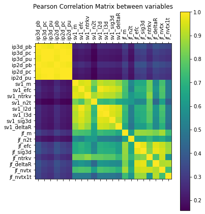
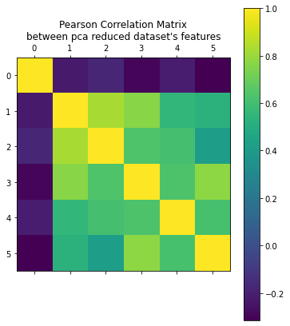
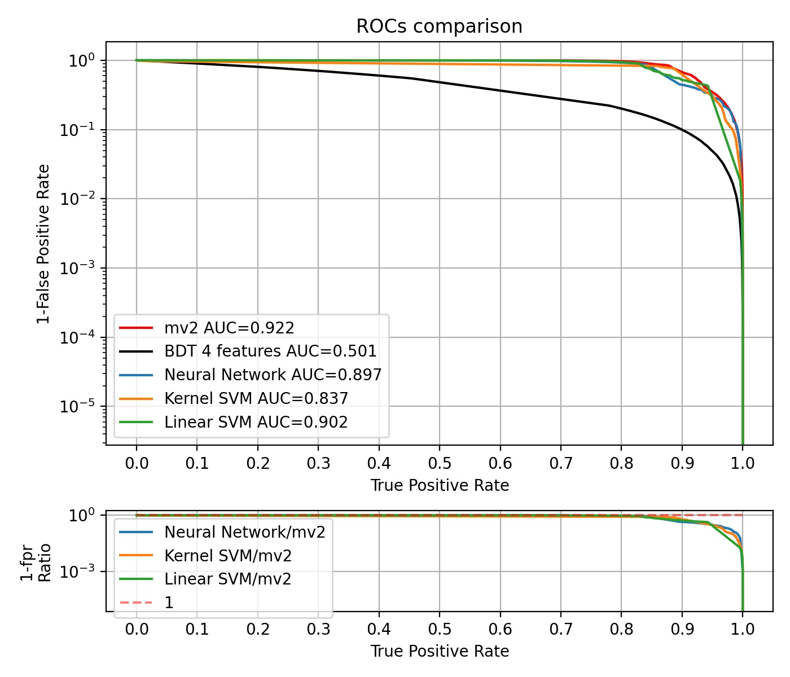
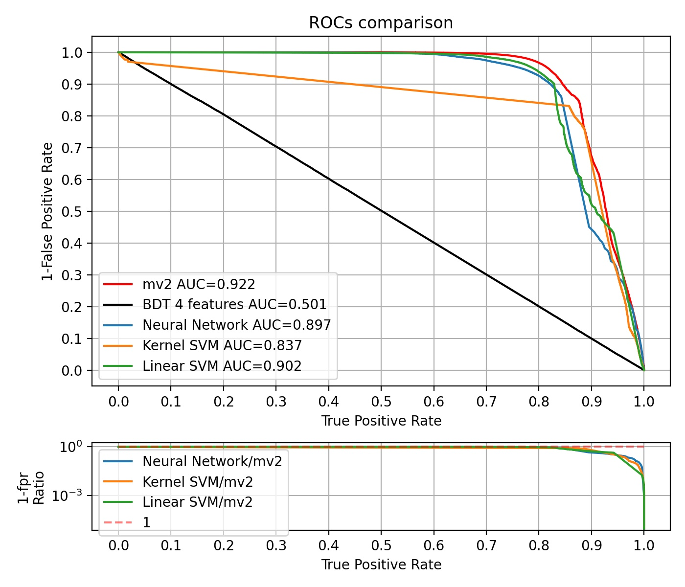
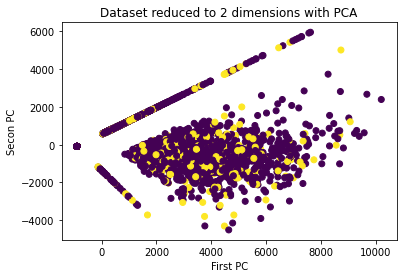

## Fisica delle Interazioni fondamentali ai Collider: Esercitazione 1
Lucio Derin

## Descrizione dello svolgimento
- Per iniziare ho eseguito dei plot di correlazione tra alcune delle variabili del dataset, osservando una forte correlazione tra alcune di esse;
- Per avere un'idea completa della correlazione tra le variabili del dataset ho graficato la matrice dei Coefficienti di Correlazione di Pearson tra le variabili;

**Osservazione:** La matrice di covarianza è approssimativamente una matrice a blocchi, indicando che le variabili di output appartenenti allo stesso low level tagger sono correlate tra di loro. Si nota bene come esista anche una correlazione (più debole) tra gli output di SV e JF: essendo entrambi tagger basati sulla ricostruzione del vertice, è ragionevole che ci sia covarianza anche tra di essi. I tagger basati sul parametro di impatto sono leggermente più correlati con JF che con SV (a mio avviso è interessante). Interessante anche la scarsa correlazione tra il parametro di impatto e il numero di tracce nel vertice secondario.

- La forte correlazione tra molte variabili e l'impossibilità computazionale di usarle tutte e 22 come features negli algoritmi mi ha portato a fare dimensionality reduction sul dataset utilizzando le tecniche di PCA; di seguito la matrice dei Coefficienti di Pearson per il dataset ridotto.

**Osservazione:** questo dataset condensa il più possibile le informazioni del dataset globale, pur riducendo a 6 il numero di features. Il prezzo da pagare è che ora le variabili non hanno più una chiara interpretazione fisica (se si utilizzassero algoritmi di explainability tipo OMP forse il primo algoritmo di riduzione (vedi notebook) sarebbe da preferire, dato che conserva l'interpretazione fisica delle variabili).

- Il dataset ridotto è stato suddiviso in training set e validation set in modo da avere una composizione del 50% di segnale e fondo;

## Descrizione degli algoritmi utilizzati
### Algoritmi di benchmark
- mv2: classificatore di riferimento basato su BDT con 21 features;
- BDT: ho utilizzato la suite TMVA e le macro fornite per allenare un BDT con 4 features (le tre preimpostate più la massa ricostruita da JetFitter);
### Algoritmi aggiuntivi:
Per limiti di potenza di calcolo, tutti i seguenti algoritmi sono stati allenati su un campione di **1000 dati** provenienti dal dataset ridotto a **6 dimensioni**.

- lSVM: SVM lineare;
    - Complessità predizione: O(d^2), con d numero di features;
- kSVM: SVM con kernel trick;
    - Piccola fase di model selection con Cross-Validation per regolare i parametri del kernel e di regolarizzazione;
    - Kernel gaussiano;
    - Complessità predizione: O(N^2), con N cardinalità training set;
- NN: rete neurale semplice e non ottimizzata, con 6 layer e 32 o 64 neuroni per layer;
    - Ottimizzatore: Adam;
    - Activation Function: ReLU e Sigmoid nel layer di output;
    - Loss Function: binary cross-entropy;

### Confronto tra gli algoritmi: curve ROC
- Nota: `sklearn` (libreria con cui ho calcolato le ROC) esprime le ROC in termini di true positives reate (tpr) e false positives rate (fpr); per conservare l'andamento tipico delle curve di ATLAS ho graficato tpr vs (1-fpr).

**Osservazioni:**
- Seppur allenati su molti meno dati (ma con 2 feature in più), gli algoritmi lSVM, kSVM e NN superano BDT;
- kSVM non offre grandi purezze a basse efficienze di segnale (curioso, fenomeno probabilmente dovuto ad un po' di overfitting) ma offre purezze comparabili a mv2 ad alte efficienze di segnale;
- lSVM offre grande purezza e grande stabilità a basse efficienze di segnale, poi degrada (discorso opposto a kSVM: essendo un modello più semplice ha poco overfitting ma poi va in underfitting);
- La NN lavora bene ad altissime efficienze di segnale: lì la funzione target deve essere molto complicata, dato che kSVM e NN riescono ad approssimarla (mentre lSVM no).

## Unsupervised Learning: data visualization con PCA
Provo ad esegure lo scatterplot delle prime due componenti principali per vedere se i dati sono separabili su di esse. Si osserva che in 2D le classi di segnale e fondo sono completamente sovrapposte.

Codice completo e ulteriori osservazioni nel file [es1.ipynb](https://github.com/LucioDerin/Collider) in questa repository (sottocartella Es1_flavourTagging).