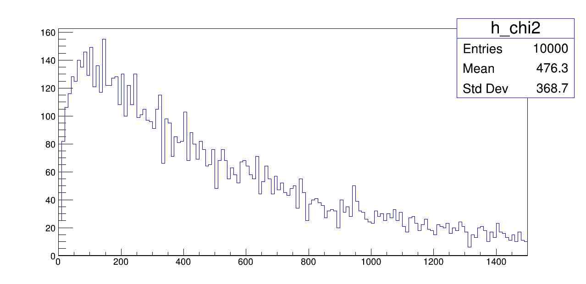
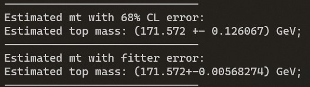

### Es2: Misura della massa del quark top tramite fit cinematico

#### Prima parte: fit cinematico
Dopo il fit con $\chi^2$ costruito in modo da vincolare le masse dei quark top e dei bosoni W (e delle rispettive antiparticelle) ricostruite dai loro prodotti di decadimento vicino al valore noto, si osservano i seguenti plot di controllo pre e post fit:
- $P^\mu$ b-jet leptonico;
- $P^\mu$ b-jet adronico;
- $P^\mu$ l-jet 0;
- $P^\mu$ l-jet 1;
- $P^\mu$ $\nu$;

Si osserva che in tutte le variabili il fit ha diminuito la deviazione standard delle distribuzioni, incrementando la risoluzione sulle variabili.

I risultati ottenuti dalle chiamate della funzione `chi2_f` sono effettivamente distribuiti come un $\chi^2$:

Infine, si osserva un notevole restringimento della distribuzione delle masse dei quark top ricostruiti sia nel canale leptonico (sx) che in quello adronico (dx):

Il canale leptonico è quello che beneficia di più dell'effetto del fit, penso a causa della difficoltà di ricostruzione del quadrimpulso del neutrino.

Ottenute le distribuzioni delle masse del quark top ricostruite dal fit cinematico si passa al secondo punto.

#### Seconda parte: fit degli istogrammi per determinare il miglior valore di $m_t$

Si ottengono i seguenti istogrammi per la massa del top dei MC e degli pseudo dati reali:

Si esegue il fit per determinare la massa MC che avrebbe generato l'istogramma più simile agli pseudo dati. Per eseguire il fit con più margine di variazione dei parametri ho provato ad inserire un errore sulle ordinate dei punti del grafico, stimandolo come $\sqrt{2ndf}$ (ovvero radice della varianza della distribuzione di $\chi^2$), ma l'aggiunta degli errori non ha cambiato il risultato (in quanto $\sqrt{2ndf} \simeq6.7\ll\chi^2$).

Si ottiene il seguente fit:

L'errore sulla massa è stato stimato in due modi differenti:
    - Come semi-intervallo[1] tra $x_1$ e $x_2$, con $x_i$ i punti di intersezione tra la parabola e la retta $y = \chi^2_{min}+1$ (intervallo al 68% del CL);
    - Con la propagazione degli errori recuperati dal fitter sulla quantità $\chi^2_{min}=-\frac{b}{2a}$;
La differenza tra i due metodi è significativa!

La discrepanza credo sia dovuta al fatto che `TFitter` segnala che la matrice degli errori al minimo non è definita positiva. Stando alla guida di `TMinuit` questo si riflette negativamente sulla precisione nella stima degli errori. Tuttavia, le principali cause descritte nella guida non sembrano combaciare con il fit, conseguentemente non saprei come correggerlo.

[1] ho scelto di utilizzare il semi-intervallo secondo il seguente ragionamento: l'intervallo $[x_1,x_2]$ contiene il valore di $m_{t}$ con un CL del 68%. Supponendo che la pdf dell'errore sia una gaussiana, per ottenere una probabilità del 68% devo integrare sull'intervallo $[m_t - \sigma_t , m_t + \sigma_t]$. Essendo questi due intervalli di eguale ampiezza (poichè corrispondono entrambi al 68% di CL), ne consegue che $\sigma_t = \frac{x_2-x_1}{2}$.

Il codice completo è consultabile alla seguente [repository](https://github.com/LucioDerin/Collider) (nella cartella Es2_topMass).